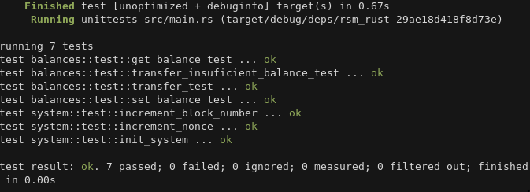
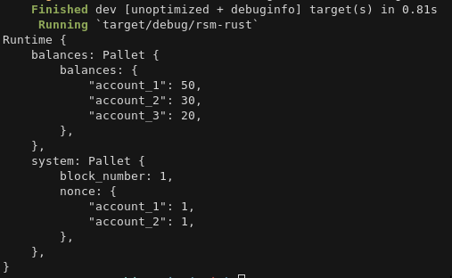

# Rust State Machine

Another proof of concept applying knowledge in rust through the rust study group. 
I'm following the same concept as the Polkadot SDK.

### Timeline 

- Tests

- State Machine 

##### Resources

- https://github.com/shawntabrizi/rust-state-machine
- https://www.shawntabrizi.com/rust-state-machine-mdbook/0/index.html
